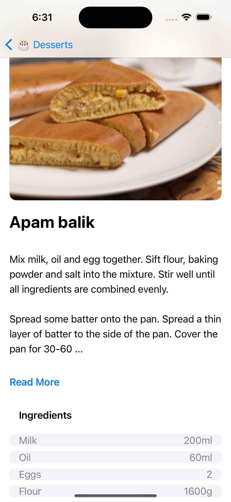

# Dessert Recipes App

## Introduction

This iOS app is developed using SwiftUI and Xcode. It's focused on displaying a variety of dessert recipes fetched from "TheMealDB" API, a public API providing a vast collection of recipes.

## Features

- **Dessert Listing**: The app uses the endpoint [https://themealdb.com/api/json/v1/1/filter.php?c=Dessert](https://themealdb.com/api/json/v1/1/filter.php?c=Dessert) to fetch a curated list of dessert recipes. Each recipe is presented in a clean, user-friendly list, sorted alphabetically for easy navigation.
  
- **Detailed Recipe View**: Selecting a dessert takes the user to a detailed view with comprehensive information about the recipe. This includes the meal name, cooking instructions, and a list of ingredients with measurements. The detail view fetches data from [https://themealdb.com/api/json/v1/1/lookup.php?i=MEAL_ID](https://themealdb.com/api/json/v1/1/lookup.php?i=MEAL_ID), ensuring real-time access to the complete recipe details.

## Visual Assets

The app includes a set of images that enhance the user interface:
- : Illustrates the main list of dessert recipes.
- : Displays the detailed information for a selected dessert.
- : Serves as the introductory screen, welcoming users to the app.

These images are stored in the `Assets` folder and are integral to the visual appeal of the app.

## Folder Structure

The project is organized into several folders to maintain a clean architecture:

- **Model**: Contains the data structures and networking code responsible for fetching and decoding the JSON data from TheMealDB API.

- **Views**: Includes all the SwiftUI view files:
  - `IntroView.swift`: The first screen the user sees, providing a visually engaging entry point to the app.
  - `ListView.swift`: Displays the list of desserts fetched from the API.
  - `DetailedView.swift`: Shows the detailed recipe information for the selected dessert.

## Usage

After launching the app, users are greeted with a welcome screen, followed by a list of dessert recipes. Tapping on a recipe navigates to a detailed page with all the necessary information to start cooking a sweet masterpiece.

## Installation

To run this app, clone the repository to your local machine: git clone [https://github.com/sivamunaganuru/DessertsApp](https://github.com/sivamunaganuru/DessertsApp)

Open the project in Xcode and run it on a simulator or a physical device.

